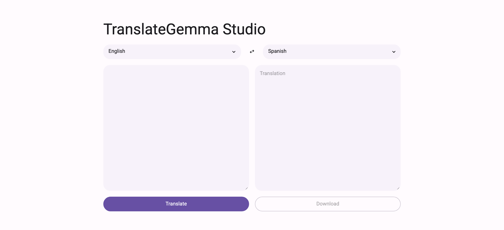
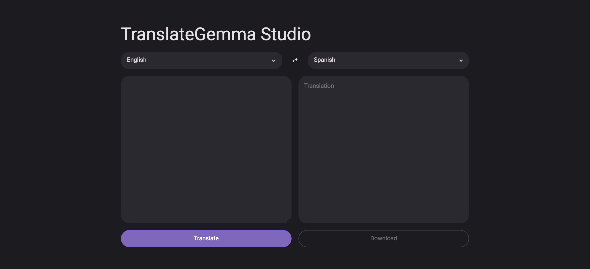

# TranslateGemma Studio

[](https://github.com/darylalim/translategemma-studio/actions/workflows/ci.yml)
[](https://github.com/darylalim/translategemma-studio/releases)
[](LICENSE)


Translate text between 295 languages entirely on your Mac — no cloud, no API keys, nothing leaves your machine. A Streamlit app that runs Google's [TranslateGemma](https://huggingface.co/google/translategemma-4b-it) locally on Apple Silicon via MLX.

<p align="center">
  
  
</p>

## Features

- **Text translation** — translate text between supported languages
- **Streaming output** — translation streams in token-by-token as the model generates
- **Token counter** — live input usage against the model's context window, with translation blocked when the input is over budget
- **Swap languages** — swap source and target languages, moving translation output to source input
- **Download as text** — download translation output as a `.txt` file
- **Light and dark mode** — Material Design styling with an in-app theme switcher

## Supported Languages

295 languages from the [TranslateGemma Technical Report](https://arxiv.org/pdf/2601.09012):

- **225 bidirectional** — paired with English in both directions (e.g., French, Japanese, Swahili)
- **70 from-English-only** — can only receive translations from English (e.g., Albanian, Finnish, Tamil)

Quality varies. 55 of the 295 have published WMT24++ benchmark scores in the technical report; the rest are trained but not formally evaluated.

## Model

Runs the 8-bit MLX quant [`mlx-community/translategemma-4b-it-8bit`](https://huggingface.co/mlx-community/translategemma-4b-it-8bit) (~4B parameters). On first launch it downloads from the Hugging Face Hub (~4–5 GB) and is cached; later runs load from that cache. All inference is local.

## Requirements

- Python 3.12+
- Apple Silicon Mac
- ~4–5 GB free disk for the model, and 8 GB+ unified memory recommended

## Setup

```bash
uv sync                                  # install dependencies
uv run streamlit run streamlit_app.py    # run the app
```

## Development

```bash
uv run ruff check .            # lint
uv run ruff format .           # format
uv run ty check                # typecheck
uv run pytest                  # run tests
uv run pytest --cov            # run tests with coverage
```

CI (`.github/workflows/ci.yml`) runs lint, format check, typecheck, and tests on every push to `main` and PR — on `macos-14`, since `mlx-lm` ships macOS-only wheels.

## License

This project's code is released under the [MIT License](LICENSE).

The TranslateGemma model it downloads at runtime is subject to Google's [Gemma Terms of Use](https://ai.google.dev/gemma/terms) — the MIT License covers the code in this repository, not the model weights.
